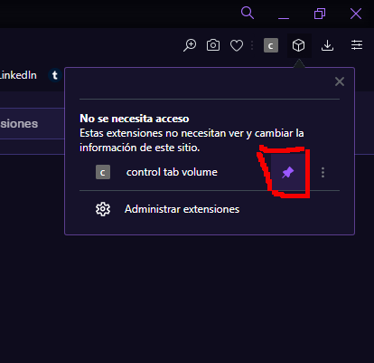

# Opera Volume Controler

It is a small plugin that serves to control the volume of videos and audios that are on a page (still under development).

## Usage

Just select the range volume using the scroll or the numeric input, you can also use float values

## Instalation

[1] Download the project using "git clone https://github.com/AllWKA/opera-volume-controller.git" OR downloading it from github as zip and unzip it

[2] Now go in your browser to [opera://extensions/](opera://extensions/)

[3] Add the plugin folder

and select the folder

[4] If you want you can lock the plugin

